# Spring Boot Application deployment in Azure
This code repo is having below folders
1.  **Pipelines:** Infra and Application deployment Pipelines.
2.  **Infra:** Terraform code to deploy the basic Infra for the Spring Boot application to deploy in multiple environments
3.  **sourceCode:** Spring Boot Application code
4.  **kubernetesManifest:** Kubernetes Manifest files
    - Namespace,Load Balancer Service,Deployment,Horizontal Pod Autoscalar files.

## Assumptions and Considerations:
- Deploying application in Azure Cloud
- Azure DevOps is used for all the repository,CI/CD pipelines etc.Please make sure Org,projects and repos are created ahead.
- Terraform is used as IaC
- Considering only dev and prd are the environments and both can be deployed in same subscription.
- Create Service principal and Service connection in Azure Devops to integrate with Azure Cloud and make sure Owner or Contributor access is provided.
- Create Storage account prior for Terraform State file. We can later import the Storage account to the terrform code. Please see end for the statefile snapshot.
- Please also note that private VNET and private endpoints are not considered for this assignment. Can be easily included based on requirement.

## High Level Architecture

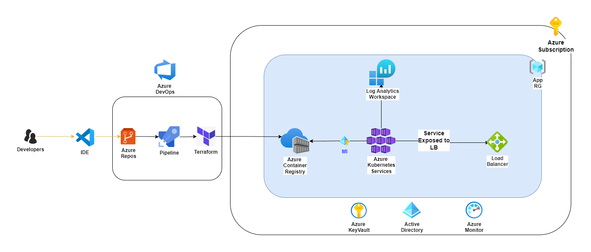

1. As you see in the above picture, we are using Azure cloud for the spring Boot application deployment
2. Azure Container Registry is used to build, managed and store all the container Image privately in Azure.A private container registry allows you to securely build and deploy your applications and custom code.
3. Azure Kubernetes Services , a popular kubernetes orcherstation services in Azure is used to deploy large scale spring boot application. In AKS service, Azure handles most of the overhead critical tasks, like control plane management ,cluster health monitoring and maintenance. This control plane is provided at no cost as a managed Azure resource. We can use one AKS for hosting multiple applications, also with proper management and architecture, we can deploy multiple environments to same AKS. 
4. We can also consider Azure Container Instance for the small load applications. But i have used here AKS.
5. Azure Log Analytics workspace is used to collect memory and processor performance metrics from containers, nodes, and controllers within AKS clusters and deployed applications. We can also consider Prometheus and Grafana, but for the assignment purpose, i have used all the azure resources.
6. Azure Key Vault is used to store secrets like Admin Kubeconfig when the AKS is created etc.

## Application CI/CD:

Once the basic Infra is created, we can deploy the source code using below application pipeline.

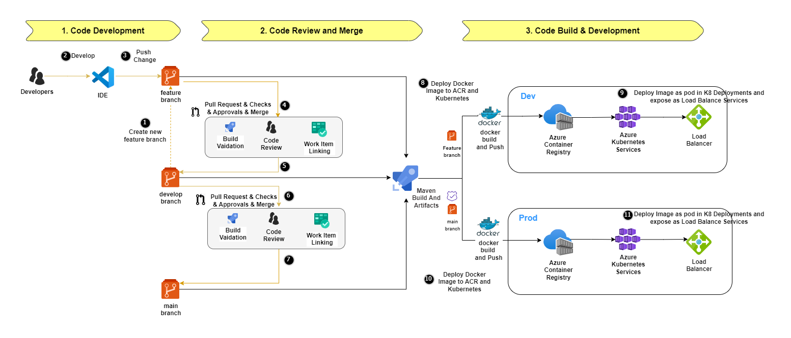

1. Maven task is used to create the Jar file needed for the Docker Image
2. Create the artifacts with all needed file for the appplication deployment
3. Once successful Docker Task is used to build and push the image to ACR and tag with build number, it is based on the Dockerfile created. File is available in kubernetesManifest/Dockerfile.
4. Get the latest version of the image from ACR and use the version to apply in k8 deployment file.
5. Form the image name and replace it in the k8 deployment file.
6. Deploy the Kubernetes objects using the kubectl file commamd which are available in kubernetesManifest/springboot*.yaml

## Infra Pipeline:

1. In order to run the Infra Pipeline, please make sure points in assumptions are already taken care.
2. Create a pipeline, using pipelines/infra-pipeline.yml file.
3. Select the environment and app name for the naming convention. All the resources are created based these 2 parmeters. Here we are using dev as environment name and sbappx2 as the App name
4. This pipeline is created to Validate,Plan and Apply the Infra code to Azure using Terraform having 2 stages. 1. Validate and 2. Deployment
5. You can also select the destroy the Infra after creating if you select the destroy flag. But the resource group is locked while creating, so removing the lock is manual, added this just to make sure accidental deletion of any resources in resource group.

**NOTE: Please see end of the README for the resource details in the Azure Cloud**

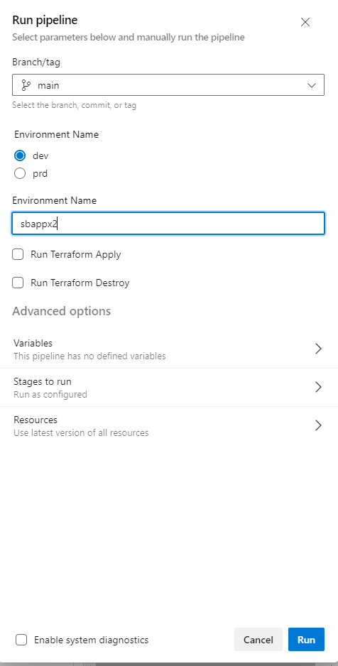

## Application Deployment Pipeline:

1. In order to run the application Pipeline, please make sure points in assumptions are already taken care.
2. Create a pipeline, using pipelines/sprint-boot.yml file having 2 stages. 1. Build and Artifact and 2. Deployment
3. Select the environment and app name for the naming convention. All the resources are created based these 2 parmeters. Here we are using dev as environment name and sbappx2 as the App name
4. This pipeline is created to generate jar file using Maven, test it,Build,push the image to ACR and deploy the recent version in AKS as a deployment and expose the pod as Load Balancer service on port 8080.
5. HPA is used to scale the Pod based on the CPU metrics.

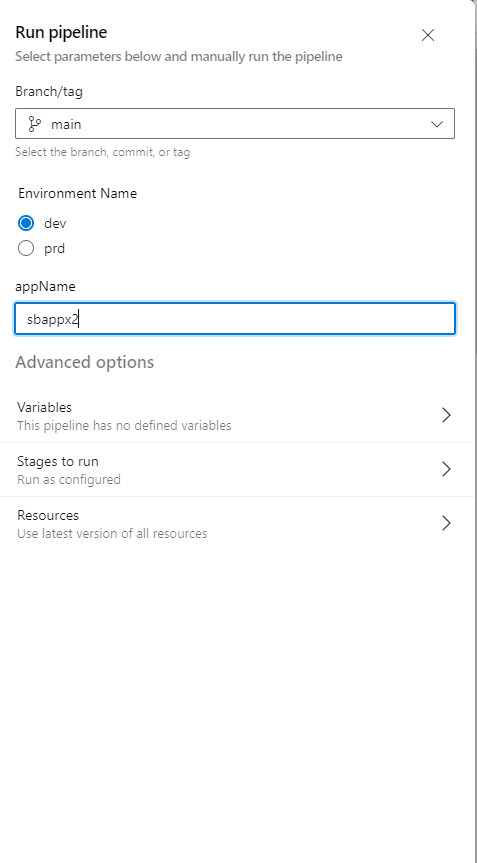

## Snapshots of the resources created in Azure and Application.

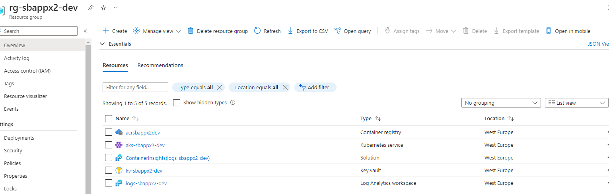

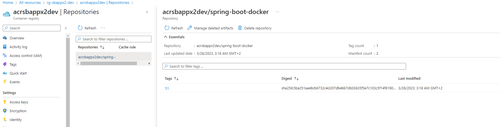

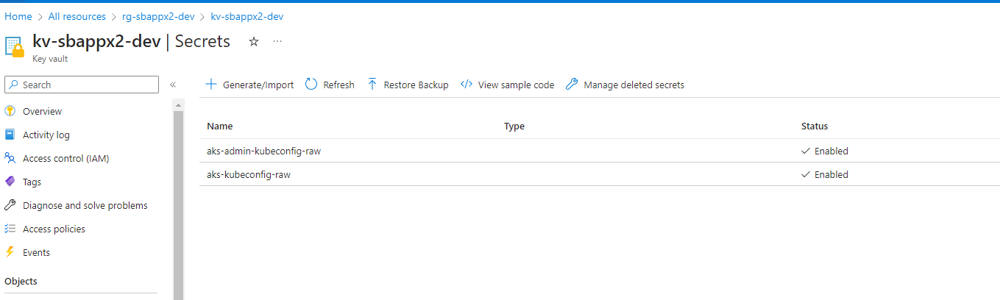

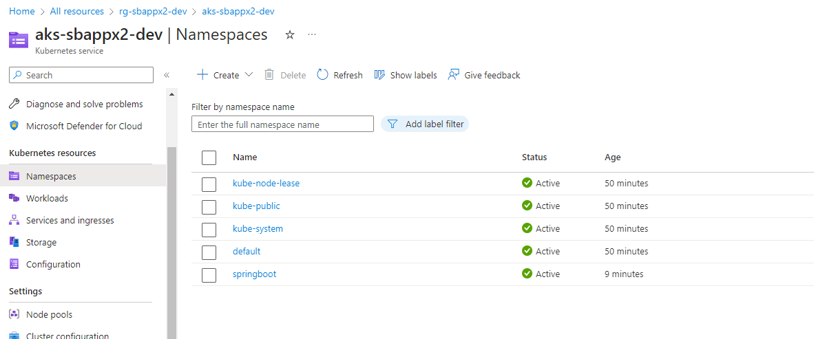

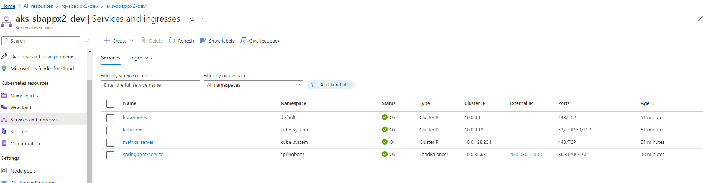

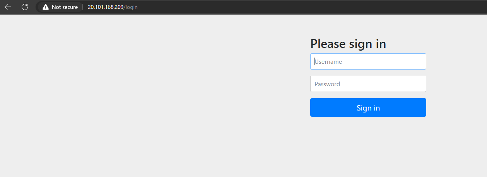

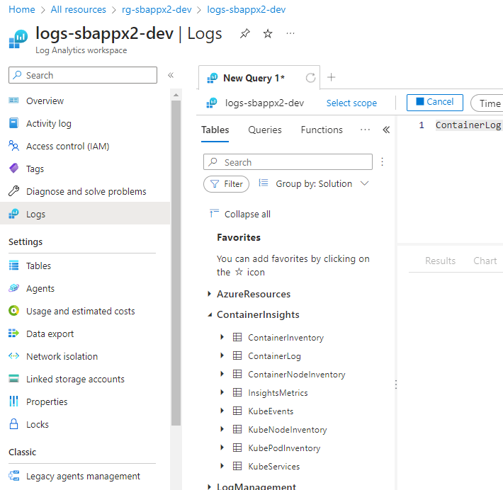

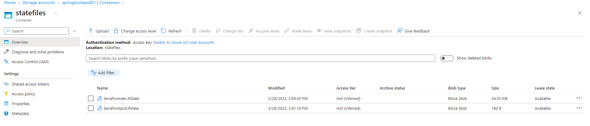

